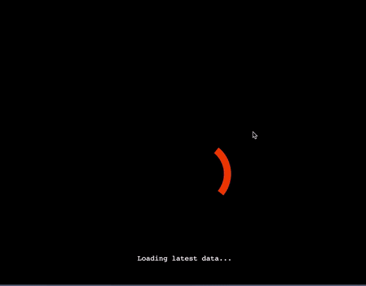

# [COVID-19 Globe Tracker](https://tanmaylaud.github.io/covid19-globe-tracker)

## Tracking worldwide cases on an interactive 3D globe

### Designed using React and Globe.gl

#### The globe model is built using Globe.gl and opensource globe textures. It is heavily inspired by covid3d.live.

#### [React](https://reactjs.org) facilitates the overall process of writing components, ensures stable code, boosts productivity and leads to faster rendering

## Built with

- [globe.gl](https://github.com/vasturiano/globe.gl)
- [d3.js](https://d3js.org/)
- [reactjs](https://reactjs.org)

## License

Licensed under the [GNU General Public License](LICENSE.md).

## Acknowledgments

- Inspired by https://covidvisualizer.com
- Inspired by https://covid3d.live
-
- Flags from https://corona.lmao.ninja
- Coronavirus data is fetched from
  - https://covid3d-backend.now.sh
  - https://github.com/bumbeishvili/covid19-daily-data
